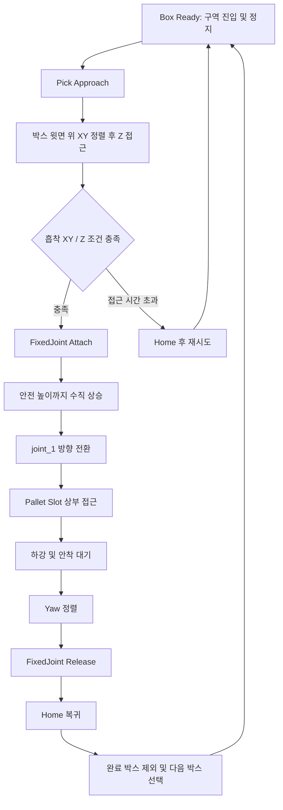
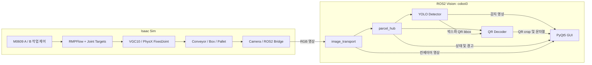

# Isaac Sim Dual-Robot Parcel Sorting & Palletizing

**Doosan M0609 ×2 · NVIDIA Isaac Sim · RMPFlow · VGC10 · ROS2 · Vision**

NVIDIA Isaac Sim 물류 환경에서 두 대의 Doosan M0609가 컨베이어의 박스를 집어 각 팔레트에 적재하는 로봇 시뮬레이션입니다. Robot A와 B는 OnRobot VGC10 흡착을 모사한 FixedJoint grasp와 RMPFlow 기반 위치·자세 제어를 사용해 Pick & Place를 수행합니다.

ROS2 Vision 패키지는 카메라 영상에서 택배 박스와 QR 라벨을 감지하고, QR 판독 결과와 노드 상태를 PyQt5 GUI에 표시합니다. 로봇 적재와 Vision 모니터링을 함께 구성하며, QR 목적지에 따른 A/B 자동 라우팅은 후속 통합 대상입니다.

## Demo

<p align="center">
  
  
</p>

Isaac Sim 환경에서 Doosan M0609의 박스 Pick & Place 및 Palletizing 동작을 시연합니다.

## Project Overview

`parcel-sorting-isaac-sim`은 컨베이어 이송, 로봇 흡착·운반, 팔레트 적재, 영상 인식을 하나의 물류 시나리오에서 다루는 프로젝트입니다. 시뮬레이션은 박스의 위치와 정지 상태를 기준으로 작업을 시작하고, Vision은 ROS2 카메라 영상으로 박스·라벨 정보를 추출합니다.

[Conveyor_lift.usd](isaacsim_dual_robot_palletizing/Conveyor_lift.usd)를 중심으로 M0609, 그리퍼, 박스, 팔레트와 물류 환경 리소스를 함께 제공합니다. A/B 단독 실행으로 각 셀의 동작을 살펴보거나, dual runner로 두 로봇을 같은 World에서 운영할 수 있습니다.

## Key Features

| 기능 | 구현 내용 |
|---|---|
| Dual M0609 Palletizing | A/B별 박스·팔레트·slot marker를 사용하는 적재 작업과 standalone/dual 실행 |
| Shared World Operation | 하나의 SimulationApp과 World에서 두 task를 등록하고 한 번의 공통 reset 후 운영 |
| Motion Control | RMPFlow Cartesian 목표와 joint target 제어를 조합한 접근·수직 상승·방향 전환·적재 |
| VGC10 Grasp Simulation | 흡착점과 박스 윗면의 XY/Z 조건을 확인하고 PhysX FixedJoint로 결합·해제 |
| Pallet / Virtual Forklift | profile별 팔레트 하강과 A의 가상 지게차 운반 시퀀스 |
| YOLO Parcel & QR Detection | YOLO11 기반 `package`·`qr_label` 감지와 박스–QR 매칭 |
| QR Decoding | QR bbox crop, pyzbar 판독, OpenCV QRCodeDetector fallback |
| ROS2 Monitoring | 영상 재배포, 노드 heartbeat·watchdog, PyQt5 영상·QR·상태 표시 |

## System Workflow

기본 Pick & Place 흐름입니다. 박스 준비 판정은 시뮬레이션의 위치·정지 상태를 사용합니다.



A standalone은 yaw 정렬을 하강·안착 단계와 함께 수행합니다. 팔레트 하강과 가상 지게차 동작은 각 profile의 적재 진행 상태에 따라 이어집니다.

## System Architecture



Dual runner는 ROS2 Bridge를 활성화하며, USD의 카메라 graph를 영상 입력 경로로 사용합니다. 게이트는 시뮬레이터 호스트의 `/tmp/zone_command.txt`에서 `A` 또는 `B`를 읽어 지연 개폐합니다. `/qr_code`를 이 파일 명령으로 변환하는 연결은 아직 구현되어 있지 않습니다.

## Dual-Robot Palletizing

| 구성 | Robot A | Robot B |
|---|---|---|
| 로봇 root | `/World/m0609_A` | `/World/m0609_B` |
| 작업 박스 | `OriBoxA_*` | `OriBoxB_*` |
| 팔레트 | `/World/APalt` | `/World/BPalt` |
| Slot marker | `APalt_slot_01`, `APalt_slot_02` | `BPalt_slot_01`, `BPalt_slot_02` |
| Standalone 특성 | 하강·안착 중 yaw 정렬, 적재 후 팔레트 하강·가상 운반 | 반복 slot 경로, 두 번째 release 후 home 복귀와 BPalt 하강 병행 |
| Dual 특성 | 두 박스 적재 후 APalt 가상 운반 | 두 박스 적재, 가상 지게차 비활성 |

[config.py](isaacsim_dual_robot_palletizing/M0609/palletizing/config.py)의 네 profile이 로봇 경로, 박스 선택, slot 순서와 팔레트 처리 정책을 정합니다. Standalone은 각 셀을 독립 프로세스로 실행하며, dual은 A/B 각각 두 slot·한 층을 사용하고 층별 팔레트 하강은 비활성화합니다.

[Dual runner](isaacsim_dual_robot_palletizing/M0609/run_ab_dual_robot_ros_gate.py)는 두 task를 등록한 뒤 World를 한 번 reset하고, A/B worker를 번갈아 진행합니다. 미리 배치된 박스의 물리 활성화 순서는 A01 → B01 → A02 → B02입니다. 각 worker는 task callback에서도 자신의 로봇·흡착점·joint 경로와 작업 상태를 사용합니다.

가상 지게차 동작은 팔레트와 적재 박스를 들어 이동시키는 scripted 시퀀스입니다. 자율주행 지게차의 경로 계획이나 포크 접촉 제어는 포함하지 않습니다.

## Motion Control

M0609의 [URDF](isaacsim_dual_robot_palletizing/M0609/doosan-robot2/urdf/m0609_isaac_sim.urdf), [robot description](isaacsim_dual_robot_palletizing/M0609/rmpflow/m0609_description.yaml), [RMPFlow 설정](isaacsim_dual_robot_palletizing/M0609/rmpflow/m0609_rmpflow_common.yaml)이 관절 구조, 제어 공간, collision sphere와 motion policy를 정의합니다.

[PickPlaceController](isaacsim_dual_robot_palletizing/M0609/rmpflow/m0609_pick_place_controller.py)는 Isaac Sim의 Pick & Place event 흐름에 M0609용 RMPFlowController를 연결합니다. Worker는 별도의 [Cartesian controller](isaacsim_dual_robot_palletizing/M0609/rmpflow/m0609_rmpflow_controller.py)도 생성해 흡착점이 목표 위치에 오도록 end-effector 목표를 계산하고, 접근·상승·slot 보정·하강·yaw 정렬에 사용합니다.

큰 방향 전환은 `joint_1` 목표 제어로, home 복귀는 관절 목표 보간으로 수행합니다. RMPFlow와 joint 제어를 작업 단계별로 조합하는 구조입니다.

## VGC10 / Grasp Simulation

M0609 로봇 모델에는 기존 RG2 구성이 포함되어 있습니다. 실행 시에는 기존 그리퍼를 제거하거나 비활성화하고, [VGC10 USDA](isaacsim_dual_robot_palletizing/M0609/assets/gripper_vgc10_v1.usda)를 참조한 visual을 구성합니다. 이 visual은 `/World` 아래에서 `link_6/tool0`의 pose를 따라가며, CAD의 collider와 rigid-body 속성을 제거해 로봇 articulation과의 간섭을 줄입니다.

흡착은 다음 방식으로 모사합니다.

1. Tool pose와 local offset으로 VGC10 중심 흡착점의 월드 좌표를 구합니다.
2. 박스 bounding box의 윗면을 기준으로 XY 범위·중심 오차와 Z 간격을 검사합니다. 기본 판정은 중심점 하나를 사용합니다.
3. 조건이 맞으면 윗면의 attach anchor를 두 body의 local 좌표로 변환하고, 로봇 링크와 박스를 `UsdPhysics.FixedJoint`로 연결합니다.
4. Release 시 joint를 제거하고 박스의 rigid body·collision·gravity를 활성화해 동적 상태로 팔레트에 놓습니다.

이는 **FixedJoint 기반 suction approximation**입니다. 진공 압력, 공기 유량, 누설이나 흡착 패드 변형을 계산하는 모델은 아닙니다.

## Vision & QR

[Vision/](Vision/)은 ROS2 패키지 `cobot3`입니다. 기본 파이프라인은 다음 세 노드로 영상을 처리합니다.

| 노드 | 역할 |
|---|---|
| `parcel_hub_node` | 압축 영상 재배포, detector·QR decoder 상태 수집, watchdog 경고 발행 |
| `parcel_detector_node` | YOLO11로 `package`와 `qr_label` 감지, 박스 크기 필터링, 가까운 QR과 매칭, annotated 영상 발행 |
| `qr_decoder_node` | 박스 진행 순서와 bbox를 이용한 QR crop, pyzbar 우선 판독, OpenCV fallback, 판독 문자열 발행 |

[parcel_detector.launch.py](Vision/launch/parcel_detector.launch.py)는 포함된 `parcel_qr_det.pt`와 클래스 ID `[0, 1]`을 사용합니다. Detector 노드를 직접 실행할 때의 기본 모델·클래스 설정과 다르므로, 프로젝트 모델 추론에는 이 launch를 사용합니다.

[models/](Vision/models/)에는 기본 parcel·QR 모델과 박스 감지 모델 세 개, PatchCore memory bank·threshold가 포함되어 있습니다. PatchCore 노드는 별도 prototype이며 기본 시작 스크립트에 포함되지 않습니다.

## GUI / Monitoring

[PyQt5 GUI](Vision/cobot3/parcel_control_gui.py)는 컨베이어 영상, YOLO 감지 영상, QR crop과 판독 문자열을 표시합니다. 허브가 전달하는 노드 상태와 경고를 확인하고 이미지를 캡처할 수 있습니다.

정지·reset·threshold 조절 등의 제어 UI도 있지만, 일부 명령 토픽과 simulator consumer 연결은 추가 통합이 필요합니다. 실행 안내는 영상과 인식 결과의 모니터링을 중심으로 구성합니다.

## Tech Stack

| 영역 | 기술 |
|---|---|
| Simulator | NVIDIA Isaac Sim 5.1.0 |
| Robot | Doosan M0609 ×2 |
| Motion | RMPFlow, Cartesian / joint target control |
| End Effector | OnRobot VGC10 visual 및 suction approximation |
| Scene / Physics | USD, PhysX, UsdPhysics.FixedJoint |
| Middleware | ROS2 Humble, ROS2 Bridge, image_transport |
| Vision | Ultralytics YOLO11, PyTorch, OpenCV, pyzbar |
| GUI | PyQt5 |
| Language | Python |

## Repository Structure

```text
parcel-sorting-isaac-sim/
├── assets/                           # 동작 데모 GIF
├── isaacsim_dual_robot_palletizing/
│   ├── Conveyor_lift.usd
│   ├── M0609/
│   │   ├── robot_a_palletizing_forklift.py
│   │   ├── robot_b_palletizing_forklift.py
│   │   ├── run_ab_dual_robot_ros_gate.py
│   │   ├── palletizing/               # scene·physics·task·worker·설정
│   │   ├── rmpflow/                   # controller 및 YAML
│   │   ├── assets/                    # VGC10 USD·USDA 및 CAD 경로
│   │   ├── doosan-robot2/             # M0609 USD·URDF·mesh
│   │   ├── Collected_m0609_camera/    # 수집된 camera 구성과 참조 리소스
│   │   ├── Collected_m0609_gripper/   # 수집된 gripper 구성과 참조 리소스
│   │   └── onrobot_rg2/               # RG2 URDF·mesh
│   ├── ori0/                         # 박스 USDA 및 texture
│   ├── oriA/                         # A 박스 texture
│   ├── oriB/                         # B 박스 texture
│   ├── warehouse/                    # 물류 환경 texture
│   └── omniverse-content-production.s3-us-west-2.amazonaws.com/
│                                     # 수집된 환경·팔레트·지게차 참조 리소스
├── Vision/
│   ├── cobot3/                       # detector·QR·hub·GUI·prototype
│   ├── launch/
│   ├── scripts/start_vision.sh
│   ├── models/
│   ├── package.xml
│   └── setup.py
├── tests/
│   ├── test_palletizing_config.py
│   └── test_palletizing_runtime.py
├── docs/
│   ├── ISAAC_SIM_SMOKE_TEST.md
│   └── development/
│       ├── REFACTOR_ANALYSIS.md
│       └── REGRESSION_REVIEW_REPORT.md
└── README.md
```

메인 scene, M0609 USD·URDF·mesh, VGC10 USD·USDA, collected camera/gripper 구성, RG2 관련 모델 파일, 박스·팔레트·컨베이어·창고 환경과 texture를 포함합니다. 대형 USD·mesh·texture는 [.gitattributes](.gitattributes)의 Git LFS 규칙으로 관리합니다.

대용량 CAD 파일인 `M0609/assets/gripper_vgc10.stp`도 Git LFS로 관리합니다. Git LFS 다운로드와 checkout이 완료되면 실제 파일이 로컬 working tree에 배치됩니다. 시뮬레이션 실행에는 VGC10 USD/USDA 파일을 사용하며 STP 파일을 직접 읽지는 않습니다.

## Development Environment

개발 환경은 Ubuntu 22.04 LTS, ROS2 Humble, NVIDIA Isaac Sim 5.1.0과 NVIDIA GPU입니다. 로봇 스크립트는 Isaac Sim 제공 Python으로, Vision은 ROS2 Humble의 Python 3.10 환경에서 실행합니다.

두 PC로 분리할 때는 Isaac Sim PC와 Vision PC의 `ROS_DOMAIN_ID`를 일치시키고 유선 LAN/FastDDS를 구성합니다. 기본 Vision 시작 스크립트의 domain은 `103`입니다. GPU용 PyTorch/CUDA는 사용할 장비에 맞춰 준비합니다.

<details>
<summary>두 PC 실행용 LAN / FastDDS 설정 예시</summary>

기존 개발 환경의 설정 예시입니다. IP와 `enp131s0`는 실제 장비에 맞춰 바꿉니다.

| 항목 | 내용 |
|---|---|
| 연결 방식 | 유선 기가비트 LAN, PC 간 직결 (스위치 미경유) |
| Vision PC (`vision`) | 10.0.0.1 |
| Isaac Sim PC (`IsaacSim05`) | 10.0.0.2 |
| 유선 인터페이스명 | `enp131s0` (양쪽 PC 동일) |
| IP 할당 방식 | 정적 IP (netplan) |
| DDS 미들웨어 | FastDDS |
| ROS_DOMAIN_ID | `103` |

**a) netplan 고정 IP 설정**

각 PC에서 `/etc/netplan/99-wired-static.yaml` 파일을 생성합니다.

Vision PC (`vision`):
```bash
sudo nano /etc/netplan/99-wired-static.yaml
```
```yaml
network:
  version: 2
  ethernets:
    enp131s0:
      addresses:
        - 10.0.0.1/24
```

Isaac Sim PC (`IsaacSim05`):
```bash
sudo nano /etc/netplan/99-wired-static.yaml
```
```yaml
network:
  version: 2
  ethernets:
    enp131s0:
      addresses:
        - 10.0.0.2/24
```

양쪽 PC에서 권한 설정 후 적용:
```bash
sudo chmod 600 /etc/netplan/99-wired-static.yaml
sudo netplan apply
```

**b) 연결 확인 (ping)**

Vision PC에서: `ping 10.0.0.2`
Isaac Sim PC에서: `ping 10.0.0.1`
양쪽 모두 응답이 오면 성공입니다.

**c) FastDDS 유선 인터페이스 전용 설정**

각 PC에서 자신의 IP만 화이트리스트에 넣은 FastDDS XML 프로필을 생성합니다. (서로 다른 IP를 사용하므로 PC별로 파일 내용이 다릅니다)

Isaac Sim PC (`IsaacSim05`, IP `10.0.0.2`):
```bash
mkdir -p ~/.ros
cat > ~/.ros/fastdds_wired.xml << 'EOF'
<?xml version="1.0" encoding="UTF-8" ?>
<profiles xmlns="http://www.eprosima.com/XMLSchemas/fastRTPS_Profiles">
  <transport_descriptors>
    <transport_descriptor>
      <transport_id>udp_wired</transport_id>
      <type>UDPv4</type>
      <interfaceWhiteList>
        <address>10.0.0.2</address>
      </interfaceWhiteList>
    </transport_descriptor>
  </transport_descriptors>
  <participant profile_name="default_profile" is_default_profile="true">
    <rtps>
      <userTransports>
        <transport_id>udp_wired</transport_id>
      </userTransports>
      <useBuiltinTransports>false</useBuiltinTransports>
    </rtps>
  </participant>
</profiles>
EOF
```

Vision PC (`vision`, IP `10.0.0.1`):
```bash
mkdir -p ~/.ros
cat > ~/.ros/fastdds_wired.xml << 'EOF'
<?xml version="1.0" encoding="UTF-8" ?>
<profiles xmlns="http://www.eprosima.com/XMLSchemas/fastRTPS_Profiles">
  <transport_descriptors>
    <transport_descriptor>
      <transport_id>udp_wired</transport_id>
      <type>UDPv4</type>
      <interfaceWhiteList>
        <address>10.0.0.1</address>
      </interfaceWhiteList>
    </transport_descriptor>
  </transport_descriptors>
  <participant profile_name="default_profile" is_default_profile="true">
    <rtps>
      <userTransports>
        <transport_id>udp_wired</transport_id>
      </userTransports>
      <useBuiltinTransports>false</useBuiltinTransports>
    </rtps>
  </participant>
</profiles>
EOF
```

> ⚠️ `interfaceWhiteList`의 `<address>`는 **자기 자신의 IP**를 넣습니다 (Vision PC → `10.0.0.1`, Isaac Sim PC → `10.0.0.2`).

**d) 환경변수 설정 (양쪽 PC 동일하게)**
```bash
export ROS_DOMAIN_ID=103
export FASTRTPS_DEFAULT_PROFILES_FILE=~/.ros/fastdds_wired.xml
```
`start_vision.sh`는 `ROS_DOMAIN_ID=103`을 설정합니다. FastDDS 프로필 경로는 실행 터미널에서 별도로 설정해야 합니다.

**e) ROS2 토픽 통신 확인**
```bash
ros2 topic list
ros2 topic hz /rgb
```

양쪽 PC의 ROS domain, 프로필의 로컬 IP, 실제 publisher/subscriber QoS를 확인합니다.

</details>

## How to Run

### 1. Isaac Sim 및 외부 의존성 준비

**저장소 제공 항목:** `Conveyor_lift.usd`, M0609·VGC10 모델, 물류 환경 리소스·텍스처 파일, RMPFlow 설정, Vision 코드와 모델 가중치입니다. 새 clone에서는 Git LFS로 USD·mesh·texture 본문까지 내려받고 디렉터리 구조를 유지합니다.

**외부 설치 항목:** Isaac Sim 5.1.0, NVIDIA 드라이버/GPU 환경, ROS2 Humble, Vision용 ROS·Python 의존성입니다. 아래 명령은 Ubuntu/ROS2 환경에서 사용하며 `/path/to/...`를 실제 설치·저장소 경로로 바꿉니다.

ROS2 Humble 설치 및 apt 저장소 구성을 마친 Vision PC에서:

```bash
sudo apt install ros-humble-cv-bridge ros-humble-vision-msgs \
  ros-humble-image-transport ros-humble-compressed-image-transport \
  python3-colcon-common-extensions python3-numpy python3-opencv \
  python3-pyqt5 python3-pyzbar libzbar0 tmux

python3 -m pip install ultralytics torch torchvision pillow \
  opencv-python-headless numpy PyQt5 pyzbar
python3 -c "import torch; print(torch.__version__, torch.cuda.is_available())"
```

`opencv-python-headless`는 GUI 환경에서 OpenCV의 Qt 플러그인 충돌을 줄이기 위한 구성입니다. Python 패키지는 Vision의 ROS2 실행 환경에 설치합니다. `colcon build`는 외부 Python 패키지를 설치하지 않습니다.

### 2. Isaac Sim: A / B standalone 또는 dual 실행

각 명령은 별도 실행 모드입니다. 한 프로세스를 종료한 뒤 다른 모드를 시작합니다.

```bash
source /opt/ros/humble/setup.bash
export ROS_DOMAIN_ID=103
cd /path/to/parcel-sorting-isaac-sim/isaacsim_dual_robot_palletizing/M0609

# 아래 세 명령 중 하나를 선택
/path/to/isaac-sim/python.sh robot_a_palletizing_forklift.py
/path/to/isaac-sim/python.sh robot_b_palletizing_forklift.py
/path/to/isaac-sim/python.sh run_ab_dual_robot_ros_gate.py
```

스크립트가 상위 디렉터리의 `Conveyor_lift.usd`를 읽습니다. Standalone profile의 ROS2 Bridge는 기본 비활성이고 dual runner는 Bridge를 활성화하므로, Vision과 함께 실행할 때는 dual을 사용합니다. 카메라 graph와 `/rgb` 발행 확인 절차는 [Isaac Sim smoke test](docs/ISAAC_SIM_SMOKE_TEST.md)에 정리되어 있습니다.

### 3. ROS2 Vision 패키지 빌드 및 실행

시작 스크립트는 패키지 디렉터리의 두 단계 상위를 workspace로 계산합니다. 다음과 같이 `Vision/`을 `~/cobot3_ws/src/cobot3`에 연결하고 빌드합니다.

```bash
source /opt/ros/humble/setup.bash
export REPO_DIR=/path/to/parcel-sorting-isaac-sim
mkdir -p ~/cobot3_ws/src
ln -s "$REPO_DIR/Vision" ~/cobot3_ws/src/cobot3
cd ~/cobot3_ws
colcon build --symlink-install --packages-select cobot3
source install/setup.bash

cd ~/cobot3_ws/src/cobot3
bash scripts/start_vision.sh
```

이미 패키지가 배치되어 있다면 링크 생성은 생략합니다. [start_vision.sh](Vision/scripts/start_vision.sh)는 tmux에서 영상 압축 → hub → detector → QR decoder → GUI 순서로 실행합니다. 동일한 이름의 기존 `vision` 세션은 종료하고 다시 구성합니다. Isaac Sim은 앞 단계의 별도 프로세스로 실행합니다.

<details>
<summary>Vision 노드를 수동으로 실행하기</summary>

각 노드는 별도 터미널에서 실행하며, 모든 터미널에 다음 환경을 적용합니다.

```bash
source /opt/ros/humble/setup.bash
source ~/cobot3_ws/install/setup.bash
export ROS_DOMAIN_ID=103
```

```bash
# 터미널 1: 카메라 영상 압축
ros2 run image_transport republish raw \
  --ros-args --remap in:=/rgb --remap out/compressed:=/rgb/compressed
```

```bash
# 터미널 2: 영상 허브
ros2 run cobot3 parcel_hub_node \
  --ros-args -p input_topic:=/rgb/compressed -p output_topic:=/hub/rgb/compressed
```

```bash
# 터미널 3: 포함된 parcel_qr_det.pt 모델로 감지
ros2 launch cobot3 parcel_detector.launch.py rgb_topic:=/hub/rgb/compressed
```

```bash
# 터미널 4: QR 판독
ros2 run cobot3 qr_decoder_node --ros-args -p rgb_topic:=/hub/rgb/compressed
```

```bash
# 터미널 5: GUI
ros2 run cobot3 parcel_control_gui
```

</details>

### 4. GUI / Monitoring 확인

자동 시작 스크립트에는 GUI 실행이 포함됩니다. 컨베이어 영상 → 감지 영상 → QR crop → 판독 결과 순서로 입력을 확인하고, 허브의 노드 상태와 경고를 확인합니다.

```bash
ros2 topic list
ros2 topic hz /rgb
ros2 topic hz /hub/rgb/compressed
ros2 topic echo /qr_code
```

tmux 패널 전환은 `Ctrl+B` 후 방향키, 세션에서 빠져나오기는 `Ctrl+B` 후 `D`입니다.

## ROS2 Interface

기본 실행 구성의 주요 데이터·상태 토픽입니다.

| Topic | Type | 흐름 / 내용 |
|---|---|---|
| `/rgb` | `sensor_msgs/msg/Image` | Isaac Sim camera → image_transport, 원본 RGB |
| `/rgb/compressed` | `sensor_msgs/msg/CompressedImage` | image_transport → hub·GUI, 압축 영상 |
| `/hub/rgb/compressed` | `sensor_msgs/msg/CompressedImage` | hub → detector·QR decoder, 재배포 영상 |
| `/parcel_with_qr` | `vision_msgs/msg/Detection2DArray` | detector → QR decoder·GUI, 박스와 QR bbox |
| `/parcel_detections/annotated` | `sensor_msgs/msg/Image` | detector → GUI, 감지 시각화 |
| `/qr_crop_image` | `sensor_msgs/msg/Image` | QR decoder → GUI, QR crop |
| `/qr_code` | `std_msgs/msg/String` | QR decoder → GUI, 판독된 문자열 |
| `/hub/state` | `std_msgs/msg/String` | hub → GUI, 통합 상태 JSON |
| `/hub/alert` | `std_msgs/msg/String` | hub → GUI, 경고 |

## Engineering Highlights

| 문제 | 원인 | 적용한 개선 |
|---|---|---|
| A/B 구현 중복 | 대형 standalone 스크립트와 dual 내부 source 실행 | 공통 `palletizing/` core와 네 개의 명시적 profile로 정리 |
| Shared World에서 작업 상태 혼선 | 지연된 scene 초기화와 중첩 callback이 다른 셀의 전역 설정을 참조 | task callback과 worker 실행에 context를 적용하고 호출자 상태 복구 |
| 흡착 판정과 attach 상태 불일치 | 모듈 사이에서 최신 anchor와 성공 상태 공유 필요 | 같은 프레임의 판정 결과를 공유하고 실패 시 이전 결과 초기화 |
| VGC10 visual의 물리 간섭 | CAD collider·rigid body가 articulation에 섞이는 구성 | World 아래 visual-follow 모델로 배치하고 물리 속성 제거 |
| 팔레트 처리와 home 복귀의 시간 조율 | A/B마다 다른 하강·운반 시점 | profile별 정책과 B의 PalletLoweringCoordinator로 동시 진행 관리 |

[설정 테스트](tests/test_palletizing_config.py)와 [런타임 회귀 테스트](tests/test_palletizing_runtime.py)는 profile 차이, task context, 흡착 결과 전달, 팔레트 하강 등을 다룹니다. 런타임 회귀 테스트는 Isaac/World 대역과 NumPy를 사용하며, 실제 물리·ROS2 동작은 [smoke test](docs/ISAAC_SIM_SMOKE_TEST.md)로 확인합니다.

설계 배경과 세부 분석은 [Refactor Analysis](docs/development/REFACTOR_ANALYSIS.md), [Regression Review](docs/development/REGRESSION_REVIEW_REPORT.md)에 정리되어 있습니다.

## Limitations

- QR 판독 결과에서 A/B 게이트·로봇 라우팅으로 이어지는 자동 연결은 미완성입니다.
- 일부 GUI 제어 명령과 simulator 제어·상태 피드백은 통합이 필요합니다.
- Isaac Sim/PhysX와 ROS2를 함께 실행하는 end-to-end 검증은 smoke test 항목으로 남아 있습니다.
- Vision은 추론 코드와 가중치를 제공하며, 전체 dataset·학습·평가 재현 파이프라인과 의존성 버전 고정은 포함하지 않습니다.
- PatchCore는 별도 prototype이며, 실기 로봇 연동과 sim-to-real 검증은 구현 범위 밖입니다.

## Future Work

- QR 목적지를 A/B 작업 명령으로 변환하고 미검출·판독 실패 박스의 예외 처리 경로 설계
- Vision 결과와 적재 완료 상태를 묶는 공통 메시지·작업 스케줄러 구성
- Isaac Sim 합성데이터 생성부터 학습·평가까지 재현 가능한 파이프라인 정리
- 박스 간격·크기·적재 패턴에 따른 처리량, grasp 성공률과 충돌 시나리오 평가
- 실기 M0609·VGC10의 제어 인터페이스와 캘리브레이션을 연결하는 단계적 sim-to-real 검증
